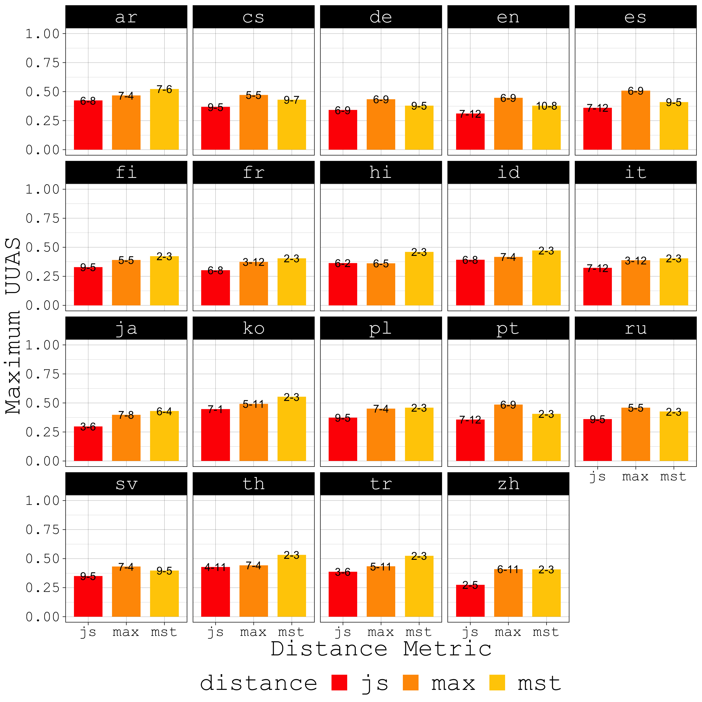
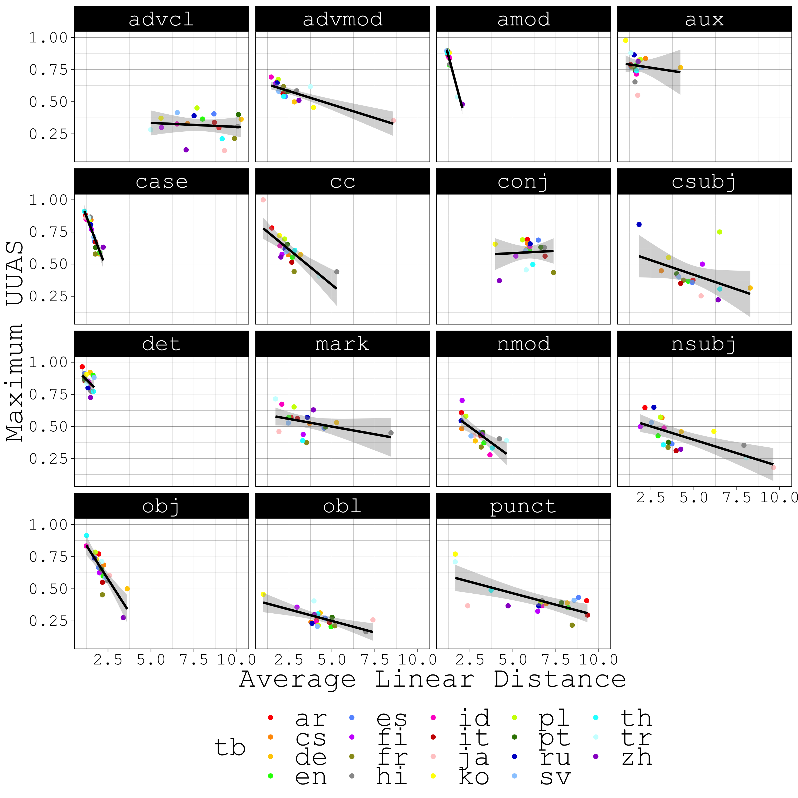

# Attention Study

## Tree Decoding

[Htut, et al. (2019)](https://arxiv.org/pdf/1911.12246.pdf) find that Masked Language Models' (BERT, ROBERTA) attention heads do not reliably encode UD dependency trees in English. For a given layer and attention head, Htut, et al. (2019) experiment with two strategies for extracting trees: *MAX* and *MST*. With *MAX*, they take the maximum incoming attention score for every word. For an $ N \times N $ attention matrix, where $ N $ is the sentence length, this amounts to taking the $ \arg \max $ over every row. With *MST*, they run the Chu-Liu-Edmonds algorithm over the matrix in order to extract a maximum spanning tree. With both approaces, Htut, et al. (2019) report Unlabeled Undirected Attachment Scores (UUAS) of approximately 40%, which is slightly better than the left-to-right positional baseline. Might we expect better accuracy if we examine other languages? Here, we replicate the experiments of Htut, et al. (2019) over the 19 languages represented in the Parallel UD treebank. In addition to their *MAX* and *MST* methods, we also consider *JS*, where we calculate the Jensen-Shannon similarity (1 - JS divergence) across all pairs of incoming attention vectors and take the argmax per word. We overlay the best performing layer-head combination on each bar in the figure below. Out of the tree approaches, *MST* works best. Layer 2, head 3 tends to provide the best decoding accuracy using *MST* for the majority of languages.

## Accuracy per Relation

Perhaps the most interesting finding of Htut, et al. (2019) is that some heads *specialize* in tracking specific dependency relations. Included among those relations are *nsubj*, *obj*, *advmod*, and *amod*, which, unlike the full trees, are decoded with higher accuracy than the position baselines. We investigate the extent to which this persists across the remaining 18 PUD languages below. 

Again, the best-performing method is *MST* and the 2-3 and 9-5 layer-head combinations are observed across many languages and relations. The easiest-to-decode relations appear to be *amod*, *aux*, *case*, and *det*. These, however, are typically easy relations where dependents often appear within one word of their heads in linear order. Below, we plot the maximum UUAS (as returned by any layer/head via *MST*) as a function of the average linear distance between words involved in a set of dependencies. 

Here, our suspicions are confirmed, as words in the easily-decodable relations appear to be, on average, very close to each other. Other relations appear to follow a predictable trend in decreasing in decoding accuracy as the distance in words becomes longer. 

## Confidence

To characterize the behavior of particular attention heads, we might also consider their *confidence*. [Voita, et al. (2019)](https://www.aclweb.org/anthology/P19-1580.pdf) define the *confidence* of a head as "*the average of its maximum attention weight excluding the end of sentence symbol, where the average is taken over tokens in a set of sentences. A confident head is one that usually assigns a high proportion of its attention to a single token. Intuitively, we might expect confident heads to be important to the translation task.*" Below, we plot the *confidence* every layer and head per language. 

Here, we tend to see the same patterns repeated across languages. Also, layer-head 2-3 appears to be consistently confident, while 9-5 does not. Below, we plot the UUAS of each layer-head combination as a function of its confidence. 

