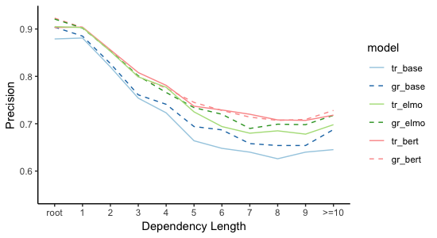

<h1>
Contextual Embeddings Error Analysis
</h1>

<h3>
sentence length
</h3>

<h3>
dependency length
</h3>

 

<h3>
distance to root
</h3>

 

<h3>
projectivity
</h3>

 

<h3>
arc direction
</h3>

 

<h3>
pos-tag
</h3>

