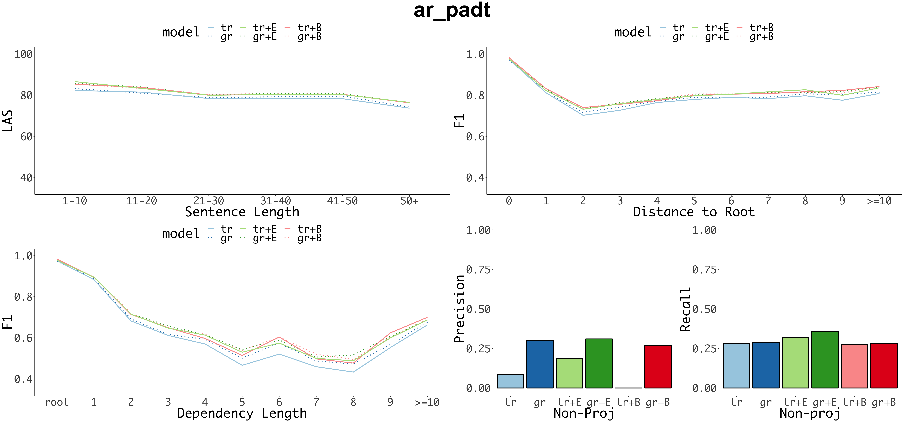
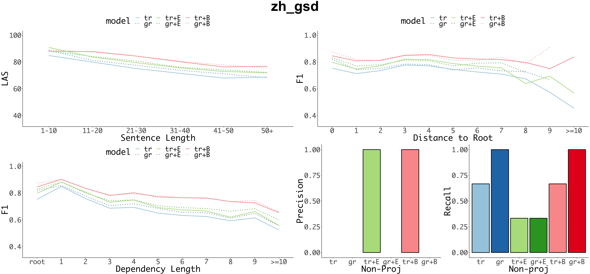
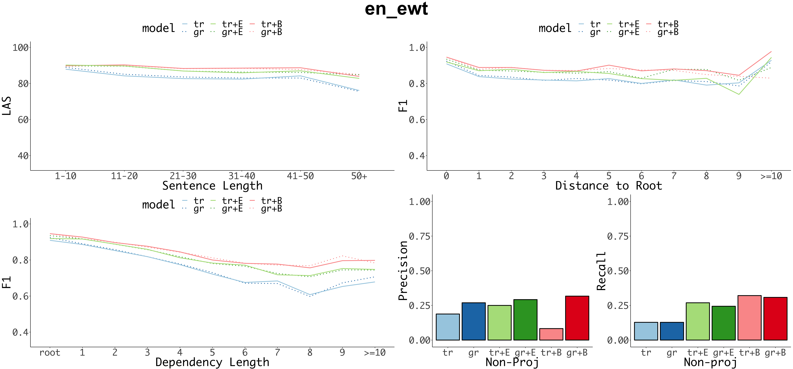
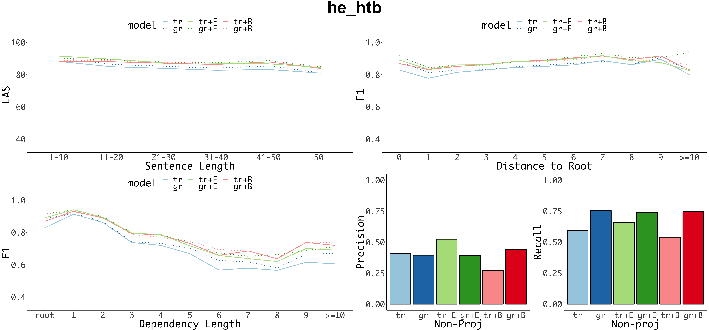
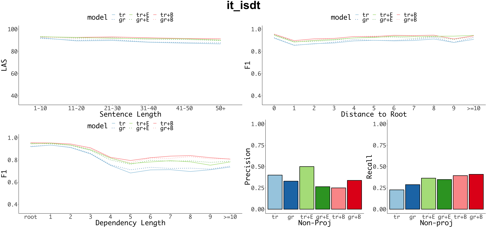
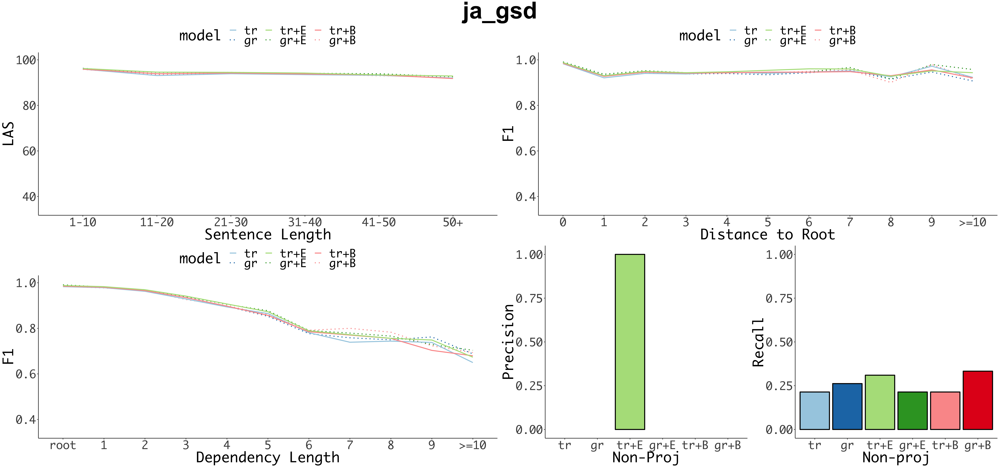
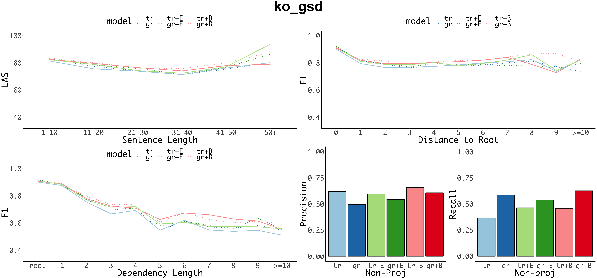
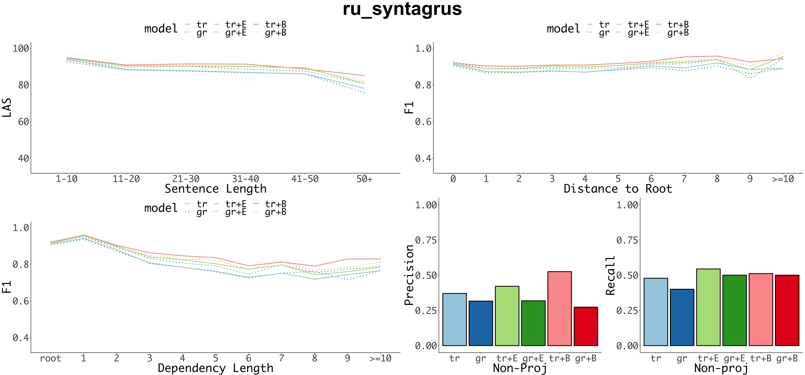
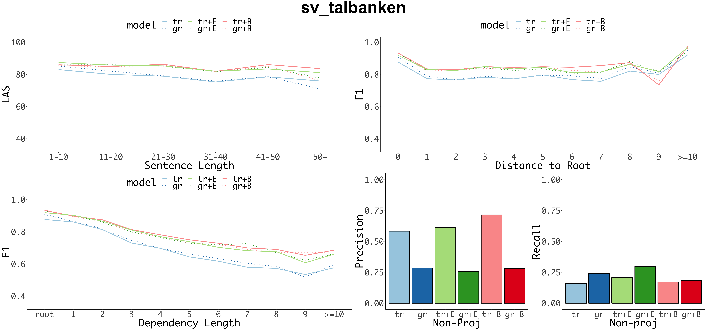
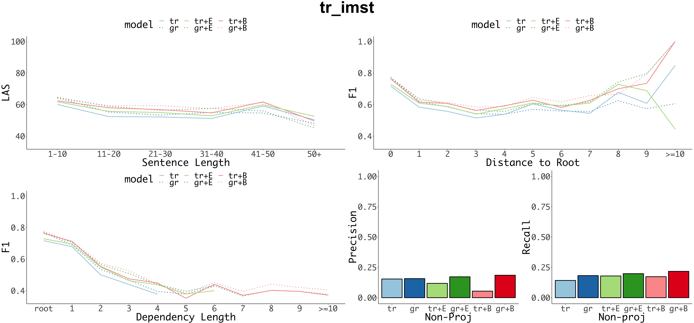

<h1>
Extended Error Analysis per Language
</h1>

<h3>
Arabic-PADT
</h3>

<h3>
Chinese-GSD
</h3>

<h3>
English-EWT
</h3>

<h3>
Basque-BDT
</h3>

<h3>
Finnish-TDT
</h3>

<h3>
Hebrew-HTB
</h3>

<h3>
Hindi-HDTB
</h3>

<h3>
Italian-ISDT
</h3>

<h3>
Japanese-GSD
</h3>

<h3>
Korean-GSD
</h3>

<h3>
Russiah-SyntagRus
</h3>

<h3>
Swedish-Talbanken
</h3>

<h3>
Turkish
</h3>

