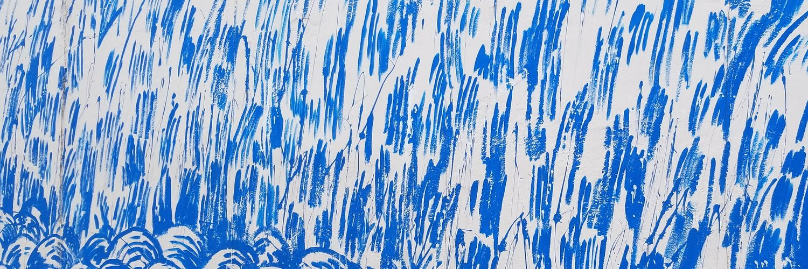

## about

I am a first-year PhD student in computational linguistics at Uppsala University (🇸🇪), supervised by Joakim Nivre and Anders Søgaard. My research interests include multilingual NLP, latent syntax, linguistic typology, and interpretability. Before my PhD, I graduated from the [EM-LCT](https://lct-master.org/) program, where I spent my first year at the University of Groningen (🇳🇱) and my second year at the the University of the Basque Country (🇪🇸). I grew up in Western Massachusetts (🇺🇸).

<!-- Hello! I am a computational linguist from Western Massachusetts, USA. I'm currently a first-year PhD student at Uppsala University (🇸🇪), where I focus on multilingual morphosyntatic parsing under the supervision of Joakim Nivre. Before starting my PhD, I graduated from the [EM-LCT](https://lct-master.org/) program, where I spent my first year at the University of Groningen (🇳🇱) and my second year at the the University of the Basque Country (🇪🇸). I wrote my Master's thesis about the utility of multilingual word embeddings in transfer learning, supervised by Eneko Agirre and Gertjan van Noord. -->

<!-- ## research Interests -->

<!-- In general, I am interested in all things concerning cross-lingual, multi-task, and transfer learning - especially when applied to low-resource languages and scenarios. I am also into multilingual word and sentence representations (embeddings, I guess). On occasion, I dabble in computational sociolinguistics.  -->

## publications
* A Kulmizev, M de Lhoneux, J Gontrum, E Fano, J Nivre: Deep Contextualized Word Embeddings in Transition-Based and Graph-Based Dependency Parsing -- A Tale of Two Parsers Revisited. Conference on Empirical Methods in Natural Language Processing (EMNLP 2019). Hong Kong.
* M Aboud, A Kulmizev, F Hill, D Low, A Søgaard: Analysing the Representational Geometry of Neural Language Encoders. Conference on Empirical Methods in Natural Language Processing (EMNLP 2019). Hong Kong.
* M Abdou, A Kulmizev, V Ravishankar, L Abzianidze, J Bos: [What can we learn from Semantic Tagging?](https://arxiv.org/pdf/1808.09716.pdf). Conference on Empirical Methods in Natural Language Processing (EMNLP 2018). Brussels, Belgium.
<!-- 2. M Abdou, A Kulmizev, JG i Ametllé: [AffecThor at SemEval-2018 Task 1: A cross-linguistic approach to sentiment intensity quantification in tweets](http://www.aclweb.org/anthology/S18-1032); Proceedings of The 12th International Workshop on Semantic Evaluation (2018) -->
<!-- 3. A Kulmizev, M Abdou, V Ravishankar, M Nissim: [Discriminator at SemEval-2018 Task 10: Minimally Supervised Discrimination](http://www.aclweb.org/anthology/S18-1167); Proceedings of The 12th International Workshop on Semantic Evaluation (2018) -->
<!-- 4. M Abdou, A Kulmizev, V Ravishankar: [MGAD: Multilingual Generation of Analogy Datasets](http://www.akulmizev.com/mgad-multilingual-generation.pdf); Proceedings of Language Resources and Evaluation Conference (LREC) (2018) -->
<!-- 5. A Kulmizev, B Blankers, J Bjerva, M Nissim, G van Noord, B Plank, M Wieling: [The power of character n-grams in native language identification](http://www.aclweb.org/anthology/W17-5043); Proceedings of the 12th Workshop on Innovative Use of NLP for Building Educational Applications (BEA) (2018) -->

---

