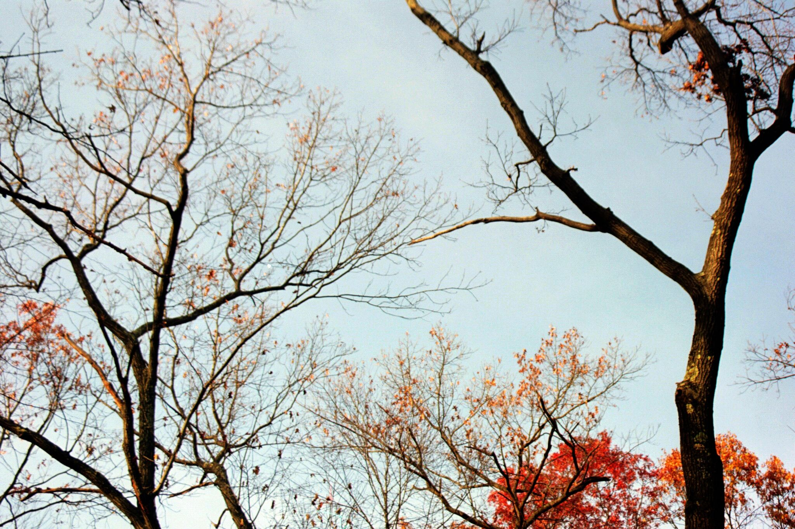

## about

I am a second-year PhD student in computational linguistics at Uppsala University (🇸🇪), supervised by Joakim Nivre and Anders Søgaard. My research interests include multilingual NLP, latent syntax, linguistic typology, and interpretability. Before my PhD, I graduated from the [EM-LCT](https://lct-master.org/) program, where I spent my first year at the University of Groningen (🇳🇱) and my second year at the the University of the Basque Country (🇪🇸). I grew up in Western Massachusetts (🇺🇸).

<!-- Hello! I am a computational linguist from Western Massachusetts, USA. I'm currently a first-year PhD student at Uppsala University (🇸🇪), where I focus on multilingual morphosyntatic parsing under the supervision of Joakim Nivre. Before starting my PhD, I graduated from the [EM-LCT](https://lct-master.org/) program, where I spent my first year at the University of Groningen (🇳🇱) and my second year at the the University of the Basque Country (🇪🇸). I wrote my Master's thesis about the utility of multilingual word embeddings in transfer learning, supervised by Eneko Agirre and Gertjan van Noord. -->

<!-- ## research Interests -->

<!-- In general, I am interested in all things concerning cross-lingual, multi-task, and transfer learning - especially when applied to low-resource languages and scenarios. I am also into multilingual word and sentence representations (embeddings, I guess). On occasion, I dabble in computational sociolinguistics.  -->

---

## publications
* A Kulmizev, V Ravishankar, M Abdou, A S{\o}gaard, J Nivre: [Attention Can Reflect Syntactic Structure _(If You Let It)_](https://www.aclweb.org/anthology/2021.eacl-main.264.pdf). EACL 2021. Digital. 
* A Kulmizev, V Ravishankar, M Abdou, J Nivre: [Do Neural Language Models Show Preferences for Syntactic Formalisms?](https://www.aclweb.org/anthology/2020.acl-main.375.pdf). ACL 2020. Digital. 
* A Kulmizev, M de Lhoneux, J Gontrum, E Fano, J Nivre: [Deep Contextualized Word Embeddings in Transition-Based and Graph-Based Dependency Parsing -- A Tale of Two Parsers Revisited](https://www.aclweb.org/anthology/D19-1277.pdf). EMNLP 2019. Hong Kong.
* M Abdou, A Kulmizev, F Hill, D Low, A Søgaard: [Higher-order Comparisons of Sentence Encoder Representations](https://www.aclweb.org/anthology/D19-1593.pdf). EMNLP 2019. Hong Kong.
* M Abdou, A Kulmizev, V Ravishankar, L Abzianidze, J Bos: [What can we learn from Semantic Tagging?](https://www.aclweb.org/anthology/D18-1526.pdf). EMNLP 2018. Brussels, Belgium.
* M Abdou, A Kulmizev, V Ravishankar: [MGAD: Multilingual Generation of Analogy Datasets](https://www.aclweb.org/anthology/L18-1320.pdf). LREC 2018. Miyazaki, Japan. 

## activities

* *April 2021* Oral presentation at EACL 2021. 
* *June 2020:* Participated in IWPT 2020 Shared Task on Parsing into Enhanced Universal Dependencies. 
* *February 2020:* Invited talk at 2020 NLPL Winter School, with Joakim Nivre. Skeikampen, Norway. 
* *November 2019:* Poster presentation and talk at EMNLP 2019. Hong Kong.
* *October 2019:* Attended 1st EurNLP summit. London, England.
* *July 2019:* Attended LxMLS 2019. Lisbon, Portugal.
* *July 2019:* Attended Reinforcement Learning Summer SCOOL. Lille, France.
* *June 2019:* Attended 3rd Google NLP summit. Zurich, Switzerland. 
* *June 2019:* Program committee, NoDaLiDa 2019. 
* *February 2019:* Attended 2019 NLPL Winter School. Skeikampen, Norway. 
* *November 2018:* Poster presentation at EMNLP 2018. Brussels, Belgium.
* *June 2018:* Poster presentation at TABU Dag. Groningen, Netherlands.
* *June 2018:* Participated in SemEval-2018 Task 1: Affect in Tweets. *Winning group*.
* *June 2018:* Participated in SemEval-2018 Task 10: Capturing Discriminative Attributes.
* *May 2018:* Poster presentation at LREC 2018. Miyazaki, Japan. 
* *September 2017:* Poster presentation at BEA 2017 @ EMNLP 2017. Copenhagen, Denmark.
* *September 2017:* Participated in BEA 2017 shared task.
* *July 2017:* Attended ESSLLI 2017. Toulouse, France.
* *June 2017:* Attended LOT Summer School. Leiden, Netherlands. 

## teaching

* *Advanced Programming*. First period, Spring Term 2020. Master's Programme in Language Technology. Uppsala University. 
* *Natural Language Processing*. Second Period, Fall Term 2019. Master's Programme in Language Technology. Uppsala University. 

<!-- 2. M Abdou, A Kulmizev, JG i Ametllé: [AffecThor at SemEval-2018 Task 1: A cross-linguistic approach to sentiment intensity quantification in tweets](http://www.aclweb.org/anthology/S18-1032); Proceedings of The 12th International Workshop on Semantic Evaluation (2018) -->
<!-- 3. A Kulmizev, M Abdou, V Ravishankar, M Nissim: [Discriminator at SemEval-2018 Task 10: Minimally Supervised Discrimination](http://www.aclweb.org/anthology/S18-1167); Proceedings of The 12th International Workshop on Semantic Evaluation (2018) -->
<!-- 4. M Abdou, A Kulmizev, V Ravishankar: [MGAD: Multilingual Generation of Analogy Datasets](http://www.akulmizev.com/mgad-multilingual-generation.pdf); Proceedings of Language Resources and Evaluation Conference (LREC) (2018) -->
<!-- 5. A Kulmizev, B Blankers, J Bjerva, M Nissim, G van Noord, B Plank, M Wieling: [The power of character n-grams in native language identification](http://www.aclweb.org/anthology/W17-5043); Proceedings of the 12th Workshop on Innovative Use of NLP for Building Educational Applications (BEA) (2018) -->

---

