<h1>
UD/SUD Probe Results and Error Analysis
</h1>

<h3>
BERT Results
</h3>

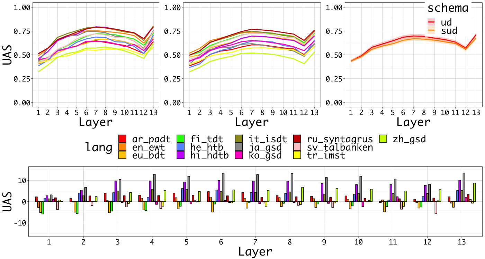

<h3>
ELMo Results
</h3>

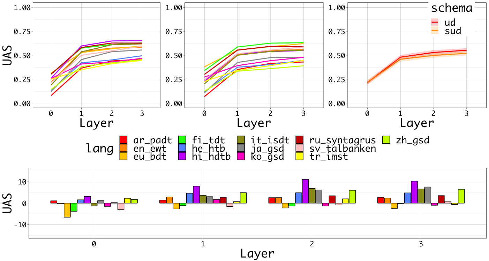

<h3>
Sentence Length
</h3>

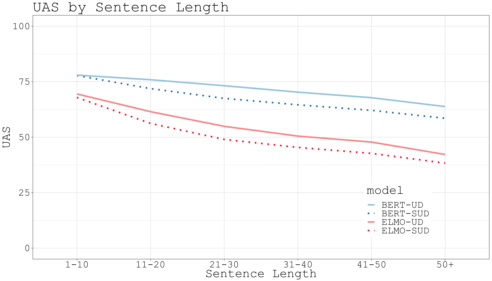

<h3>
Dependency Length
</h3>

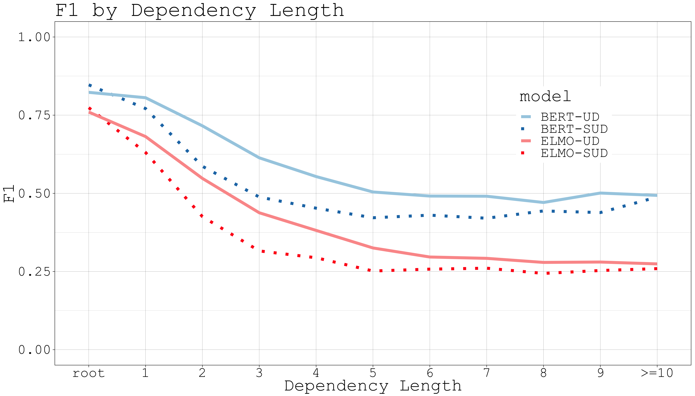

<h3>
Distance to Root
</h3>

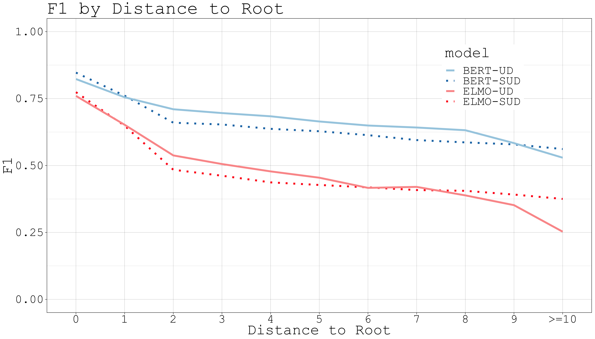

<h3>
projectivity
</h3>

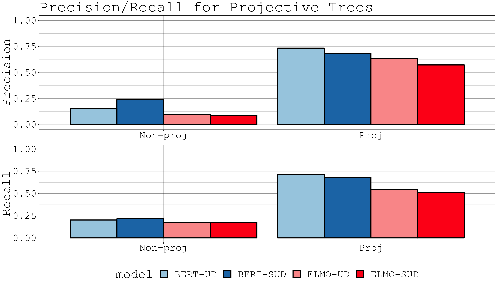

<!-- <h3>
arc direction
</h3> -->

<!-- 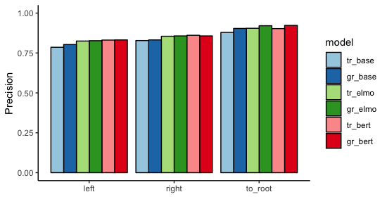 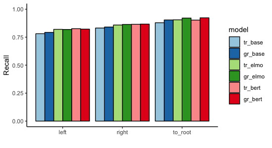 -->

<!-- <h3>
pos-tag
</h3> -->

<!-- 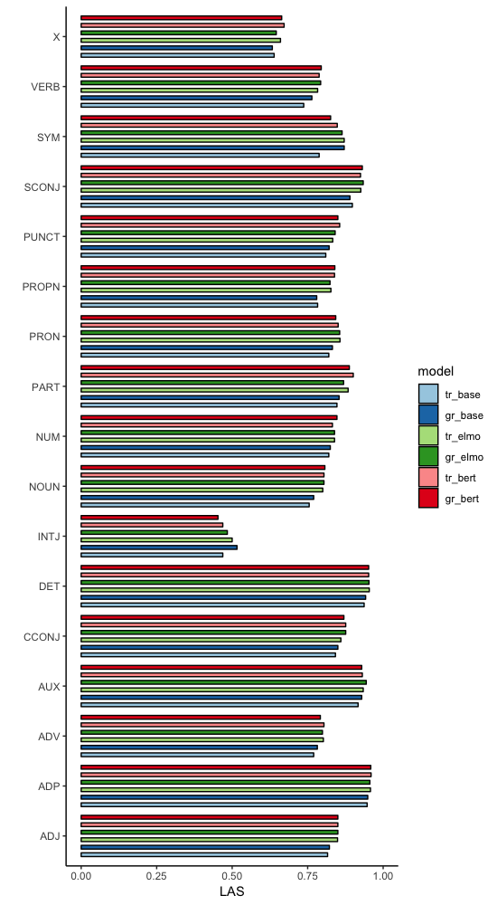 -->

<!-- <h3>
dependency relations
</h3> -->

<!-- 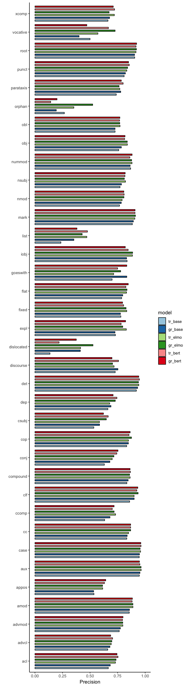 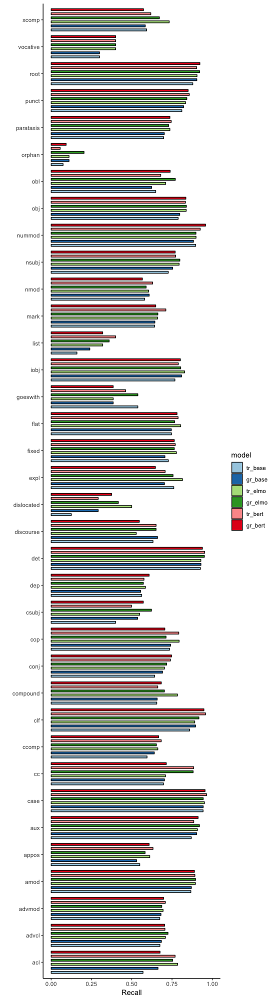 -->
