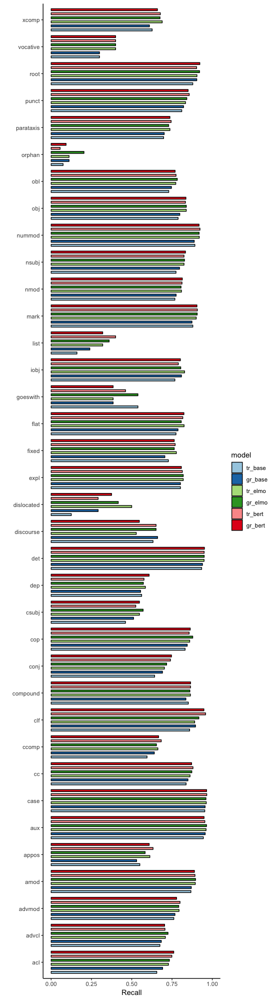

<h1>
UD/SUD Probe Results and Error Analysis
</h1>

(I collapsed the set of SUD relations into 5 categories, ignoring specific constructions denoted by ":". Not sure if this is the way to go, but it's a start.)

Since I don't have UAS scores for supervised parsers, I had to use our old LAS results for the contextualized embedding paper. Here, the top plots show the UAS score for layers 1-12 (0-2 for ELMo) plotted against the LAS for supervised parsers trained on UD. The bottom plot shows the combined layers plotted against the same, but this time grouped by language. Since the supervised results were trained on UD treebanks only, it would not be fair to compare these results to the SUD subset. However, if we think it's worthwhile, I can (re)train parsers on UD/SUD trtebanks in order to make the comparison across schema as well as UAS. 

<h3>
Tree Similarity and Difference in Score
</h3>

I thought it would be worthwhile to see if divergence in tree structure would show an interesting trend with regards to the difference in probing accuracy over UD/SUD treebanks. This plot shows the number of shared subtrees in gold UD/SUD sentences on the y-axis, plotted against the difference in probing accuracy for the same sentence on the x-axis. I was expecting to see a bowl-shaped distribution here, with most values concentrated along the 25/75 quartiles, but the plot here shows the exact opposite of that. Not sure if we should look into this further or if there is a more principled way of extracting shared structures. 

<!-- <h3>
arc direction
</h3> -->

<!--   -->

<!-- <h3>
pos-tag
</h3> -->

<!--  -->

<!-- <h3>
dependency relations
</h3> -->

<!--   -->
