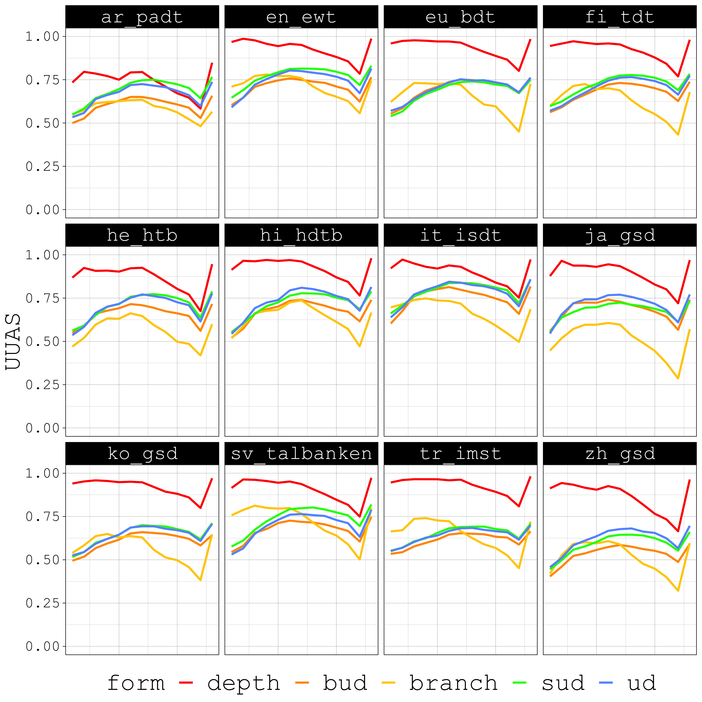
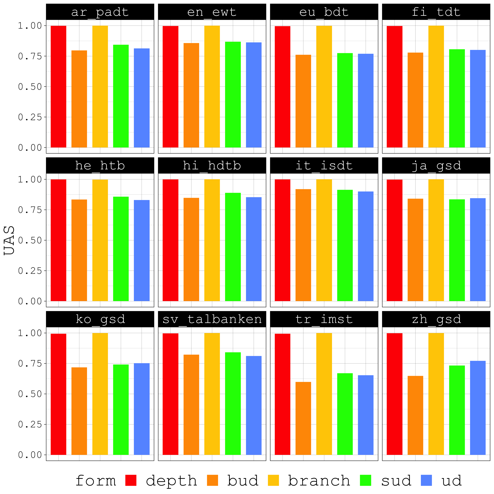

# Tree Probing Study

### Treebank Statistics

| language | treebank  | n_sents | % ADP | % AUX | % content relations |      |      | dependency length |      |      | tree height |      |      |
|----------|-----------|---------|-------|-------|---------------------|------|------|-------------------|------|------|-------------|------|------|
|          |           |         |       |       | UD                  | SUD  | BUD  | UD                | SUD  | BUD  | UD          | SUD  | BUD  |
| Arabic   | PADT      | 6075    | 17    | 1     | 0.37                | 0.24 | 0.15 | 4.17              | 3.92 | 4.23 | 7.20        | 9.82 | 7.19 |
| Basque   | BDT       | 5396    | 2     | 13    | 0.34                | 0.25 | 0.15 | 2.99              | 2.90 | 2.97 | 3.49        | 4.18 | 3.35 |
| Chinese  | GSD       | 3997    | 5     | 3     | 0.37                | 0.30 | 0.21 | 3.72              | 3.74 | 3.96 | 4.30        | 6.56 | 4.21 |
| English  | EWT       | 12543   | 8     | 6     | 0.20                | 0.12 | 0.05 | 3.13              | 2.94 | 3.18 | 3.48        | 5.11 | 3.48 |
| Finnish  | TFT       | 12217   | 2     | 7     | 0.35                | 0.30 | 0.24 | 2.98              | 2.91 | 3.06 | 3.42        | 4.22 | 3.41 |
| Hebrew   | HTB       | 5241    | 18    | 2     | 0.28                | 0.14 | 0.06 | 3.76              | 3.53 | 3.82 | 5.07        | 7.30 | 5.03 |
| Hindi    | HDTB      | 13304   | 22    | 9     | 0.26                | 0.10 | 0.03 | 3.44              | 3.05 | 3.66 | 4.25        | 7.41 | 4.24 |
| Italian  | ISDT      | 13121   | 15    | 5     | 0.21                | 0.08 | 0.02 | 3.30              | 3.12 | 3.41 | 4.21        | 6.28 | 4.20 |
| Japanese | GSD       | 7125    | 25    | 14    | 0.31                | 0.10 | 0.03 | 2.49              | 2.08 | 2.40 | 4.40        | 8.18 | 4.40 |
| Korean   | GSD       | 4400    | 2     | 0     | 0.58                | 0.57 | 0.55 | 2.20              | 2.17 | 2.26 | 3.86        | 4.07 | 3.78 |
| Russian  | SynTagRus | 48814   | 10    | 1     | 0.31                | 0.22 | 0.17 | 3.28              | 3.13 | 3.28 | 4.21        | 5.24 | 4.19 |
| Swedish  | Talbanken | 4303    | 12    | 5     | 0.29                | 0.17 | 0.10 | 3.14              | 2.98 | 3.26 | 3.50        | 5.02 | 3.48 |
| Turkish  | IMST      | 3664    | 3     | 3     | 0.33                | 0.30 | 0.26 | 2.21              | 2.12 | 2.22 | 3.01        | 3.37 | 3.00 |

## Structural Probe Results, UAS

## Structural Probe Results, UAS, Mixture

## Structural Probe Results, UUAS

## Structural Probe Results, UUAS, Mixture

## Bilinear Probe Results, UAS

## Bilinear Probe Results, UAS, Mixture

## Bilinear Probe Results, UUAS

## Bilinear Probe Results, UUAS, Mixture

## Structural Probe Results, UAS per POS

## Structural Probe Results, UUAS per POS

## Bilinear Probe Results, UAS per POS

## Bilinear Probe Results, UUAS per POS

